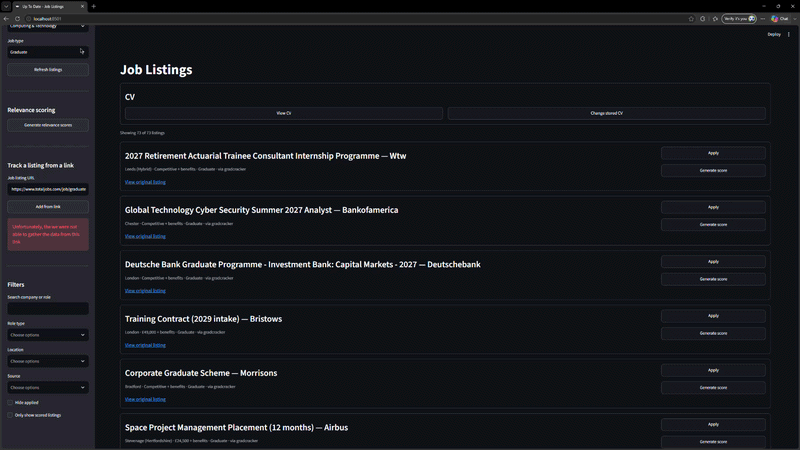
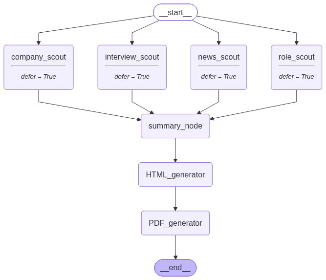

# AI powered job tracker

An up-to-date job listing platform that allows the user to search through real job applications and track their current applications.

## Demo


## Features

- Playwright job scraper to gather real job listings from the Gradcracker careers page 
- PostgresSQL database with ORM provided by SQLalchemy 
- UI to display current available job listings and users applications
- Multi-agent system using Anthropic as the LLM:
  - Interview prep agent:
    - runs 4 parallel agents to gather information about the respective job position
    - generates a PDF document with all of the gatherings
  - Job relevance agent:
    - Takes the users CV and the job description as input
    - Generates a score from 0 to 100 based on how qualified the user is for the role
    - Creates feedback on what the user must improve to qualify for the position
  - Unsupported Job Listing Scraper:
    - Allows for the user to track job listings not supported by the scraper
    - Checks if the URL input is a valid job listing
    - Uses pydantic model to produce a JobLising/Application object based on the url

### Interview prep agent framework:
Using langgraph 4 research agents are deployed in parallel to gather the following information about a job role:
    - Information and history of the company
    - Key responsibilities of the role
    - What to expect in the interview
    - Recent news about the hiring that would be relevant to know

This uses an object-oriented approach where each researcher inherits from the superclass BaseResearcher, but all are provided
different prompts to aid in them gathering the same information. The base researcher first generates a list of queries to be
used to search for relevant information using the tavily to return structured information that is better suited for use
by LLM's.

The information from the researchers is summarised and put in the format of a newsletter, HTML is then generated based on the
newsletter provided and then turned into a PDF.

### Interview Prep Agent Graph


## Setup

### Prerequisites
- [Docker Desktop](https://www.docker.com/products/docker-desktop/)
- API keys for Anthropic, Tavily, and LangSmith(optional)

### Installation

1. Clone the repository
```bash
git clone https://github.com/LucasTyrrell/Up_To_Date.git
cd Up_To_Date
```

2. Create a `.env` file in the root directory with the following variables:
```env
ANTHROPIC_API_KEY=your_anthropic_api_key
TAVILY_API_KEY=your_tavily_api_key

#optional if you want to view the agent running costs
LANGSMITH_TRACING=true
LANGSMITH_ENDPOINT=https://api.smith.langchain.com
LANGSMITH_API_KEY=your_langsmith_api_key
LANGSMITH_PROJECT="Job Search"

POSTGRES_USER=postgres
POSTGRES_PASSWORD=your_password
POSTGRES_HOST=db
POSTGRES_PORT=5432
POSTGRES_NAME=uptodate
```

3. Build and start the containers
```bash
docker compose up --build
```

4. Open your browser and go to `http://localhost:8501`

> The database is created automatically on first run. The `db` container must pass its health check before the UI starts — this takes a few seconds.

### Techstack
Python, LangGraph, SQLAlchemy, PostgrresSQL, Pydantic, Tavily, Patchright, Streamlit

## Future improvements

Although the project is in a finished state I do plan to revisit this and add additional features including:
    - Support for other job boards such as Indeed and TotalJobs
    - User account integration using Flask
    - Scheduled scrapes of the supported sites
    